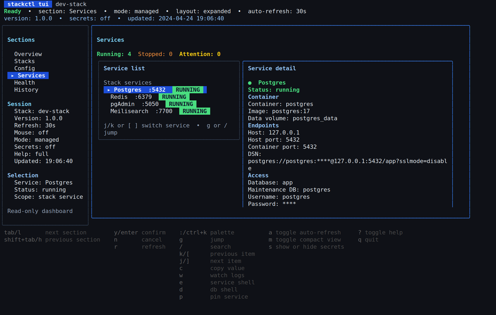

# stackctl

[](https://scorecard.dev/viewer/?uri=github.com/traweezy/stackctl)

`stackctl` gives you a local backend stack on Linux or macOS without making you
hand-maintain compose files, port maps, or connection notes.

```bash
stackctl start
```



With one CLI, you can:

- install or check the Podman runtime
- start Postgres, Redis, NATS, and pgAdmin
- inspect ports, URLs, DSNs, and exported environment variables
- switch between named stack profiles
- use a TUI for status, logs, actions, and shortcuts
- add SeaweedFS or Meilisearch when you need object storage or local search

## Why use it

`stackctl` is for teams and solo developers who want the same local stack story
across projects and machines.

Instead of asking:

- which compose file should I use
- which ports are already taken
- how do I connect to Postgres or Redis
- why did this stack fail to start

you use one CLI that answers those questions directly.

## Good fit

`stackctl` is a strong fit when you want:

- one repeatable local backend stack across projects and machines
- setup help plus clear connection details, health checks, and diagnostics
- a tool that is explicit about Podman, supported platforms, and JSON output

## Operating model

`stackctl` is opinionated on purpose:

- the managed runtime is Podman on Linux or macOS
- only one managed local stack should run at a time
- the stable automation contract is the documented CLI and JSON output, not the
  wording of prompts, spinners, or TUI copy

## Quick start

Install the latest release:

```bash
curl -fsSL https://raw.githubusercontent.com/traweezy/stackctl/master/scripts/install.sh | bash
```

If `~/.local/bin` is not on your `PATH`, add it:

```bash
export PATH="$HOME/.local/bin:$PATH"
```

Then go from a clean machine to a running stack:

```bash
stackctl setup --install
stackctl start
stackctl services
stackctl env --export
```

If you prefer the interactive path:

```bash
stackctl setup
stackctl tui
```

## What you get

Managed by default:

- PostgreSQL
- Redis
- NATS
- pgAdmin

Optional services:

- SeaweedFS for S3-compatible local object storage
- Meilisearch for local search and autocomplete

Core flows:

- `stackctl setup` to bootstrap the machine and walk through configuration
- `stackctl start`, `stop`, and `restart` to control the stack
- `stackctl connect`, `env`, and `services` to expose connection details
- `stackctl health` and `doctor` to diagnose failures
- `stackctl logs`, `exec`, `db`, and `snapshot` to operate the stack day to day
- `stackctl stack` to manage named stack profiles
- `stackctl tui` for an interactive control surface

## Supported platforms

`stackctl` targets Linux and macOS for local runtime setup.

- supported managed runtime: `podman` `4.9.3+`
- supported compose provider: `podman compose` `1.0.6+`
- macOS support uses Homebrew plus `podman machine`
- Windows is not supported

Hosted CI continuously verifies the Linux build, install, and Podman runtime
paths. Full-host Linux distro and macOS journeys are qualified in
`platform-lab` on a weekly schedule and as part of the tagged-release gate.

The compatibility contract for `1.x` is documented in
[docs/compatibility.md](./docs/compatibility.md).

## Install options

Latest release:

```bash
curl -fsSL https://raw.githubusercontent.com/traweezy/stackctl/master/scripts/install.sh | bash
```

Specific release:

```bash
STACKCTL_VERSION=vX.Y.Z
curl -fsSL "https://raw.githubusercontent.com/traweezy/stackctl/${STACKCTL_VERSION}/scripts/install.sh" | \
  bash -s -- --version "${STACKCTL_VERSION}"
```

Build from source:

```bash
git clone https://github.com/traweezy/stackctl.git
cd stackctl
go build -trimpath -o dist/stackctl .
./dist/stackctl --help
```

For pinned installs, upgrades, rollbacks, and config backups, use
[docs/install-and-upgrade.md](./docs/install-and-upgrade.md).

## Common workflows

New machine:

- `stackctl setup --install`
- `stackctl start`
- `stackctl services`

Interactive first run:

- `stackctl setup`
- `stackctl tui`

Automation-friendly environment export:

- `stackctl env --json`
- `stackctl services --json`
- `stackctl status --json`
- `stackctl version --json`

Troubleshooting:

- `stackctl doctor`
- `stackctl health`
- `stackctl logs --watch`

External stack management:

- `stackctl config init`
- choose the external stack flow in the wizard
- use `stackctl connect`, `env`, `services`, and `open` against the saved
  endpoints

## Documentation

Use [docs/README.md](./docs/README.md) as the full docs index.

If you are evaluating `stackctl`:

- [docs/install-and-upgrade.md](./docs/install-and-upgrade.md)
- [docs/platform-support.md](./docs/platform-support.md)
- [docs/compatibility.md](./docs/compatibility.md)

If you are automating or operating it:

- [docs/output-contract.md](./docs/output-contract.md)
- [docs/wiki-seed/Home.md](./docs/wiki-seed/Home.md)
- [docs/cli/stackctl.md](./docs/cli/stackctl.md)
- [docs/man/man1/stackctl.1](./docs/man/man1/stackctl.1)
- [docs/completions](./docs/completions)

If you are verifying releases:

- [docs/supply-chain.md](./docs/supply-chain.md)
- [CHANGELOG.md](./CHANGELOG.md)

## Release verification

Releases cut from the current tagged-release workflow are expected to ship
with:

- `checksums.txt`
- `checksums.txt.sigstore.json`
- per-archive SPDX SBOMs
- GitHub artifact attestations
- generated CLI docs, man pages, and shell completions

Older `0.x` tags may predate some of these assets. For historical releases,
treat `checksums.txt` as the minimum verification surface and only run the
Sigstore or attestation steps when the corresponding files exist on the
release.

Manual verification and rollback guidance lives in
[docs/install-and-upgrade.md](./docs/install-and-upgrade.md),
[docs/supply-chain.md](./docs/supply-chain.md), and [SECURITY.md](./SECURITY.md).

## Help, security, and contributing

- use the command docs in [docs/cli/stackctl.md](./docs/cli/stackctl.md) or
  `stackctl --help`
- report security issues privately as described in [SECURITY.md](./SECURITY.md)
- use GitHub issues for bugs and feature requests
- see [CONTRIBUTING.md](./CONTRIBUTING.md) for the local verification and docs
  expectations behind pull requests

## Status

The project is still in `0.x`, but the public CLI and JSON surfaces are being
stabilized for `1.x`. Track release-to-release changes in
[CHANGELOG.md](./CHANGELOG.md) and the compatibility guarantees in
[docs/compatibility.md](./docs/compatibility.md).
